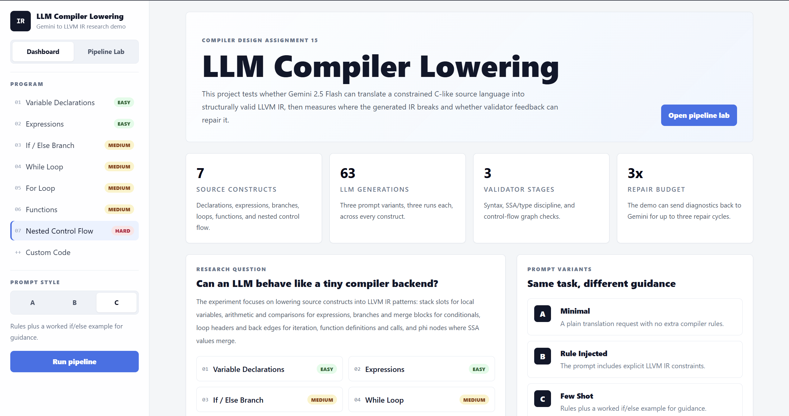

# LLM Compiler Lowering

An experimental compiler-design project that studies whether an LLM can translate a small C-like language into valid LLVM IR.

The project uses Gemini 2.5 Flash to generate LLVM IR, validates the generated IR with a custom Python checker, compares it against hand-written ground truth, and demonstrates a validator-driven repair loop for failed generations.

## Project Dashboard



## Pipeline Lab


## What This Project Does

This project asks a focused research question:

> Can a general-purpose LLM correctly perform compiler lowering for simple source-language constructs?

Compiler lowering is the process of translating higher-level source constructs into a lower-level intermediate representation. In this project, the source language is a small C-like subset and the target is LLVM IR.

The workflow is:

1. Define a small source-language subset.
2. Write ground-truth LLVM IR translations by hand.
3. Ask Gemini 2.5 Flash to generate LLVM IR from the source programs.
4. Run a custom validator on the generated IR.
5. Compare the generated IR against ground truth.
6. Categorize failures.
7. Try a repair loop where validation errors are sent back to the model.

The goal is not to build a full compiler. The goal is to measure where LLM-generated compiler IR succeeds, where it fails, and whether lightweight validation feedback can improve correctness.

## Source Constructs Studied

The experiment covers seven C-like constructs:

| ID | Construct | What It Tests |
|----|-----------|---------------|
| 01 | `var_decl` | Local variable declaration, `alloca`, `store`, and `load` |
| 02 | `expressions` | Arithmetic, comparison, and logical expression lowering |
| 03 | `if_else` | Conditional branches, basic blocks, and merge behavior |
| 04 | `while_loop` | Loop headers, back edges, and loop-carried values |
| 05 | `for_loop` | For-loop lowering through while-style control flow |
| 06 | `functions` | Function definitions, parameters, calls, and returns |
| 07 | `nested_ctrl` | Nested branching inside loops and multi-level phi behavior |

## Prompt Variants

Each construct is tested with three prompt styles:

| Variant | Name | Description |
|---------|------|-------------|
| A | Minimal | A plain request to translate source code into LLVM IR |
| B | Rule Injected | Adds explicit LLVM IR rules to guide the model |
| C | Few Shot | Adds rules plus one worked example |

Each variant is run three times for every construct:

```text
7 constructs x 3 prompt variants x 3 runs = 63 LLM generations
```

## Validation Strategy

The project does not require a local LLVM toolchain. Instead, it uses a custom Python validator in `tools/validate.py`.

The validator checks three stages:

| Stage | Purpose |
|-------|---------|
| Stage 1 | Syntax and structural checks, including known opcodes, block labels, and terminators |
| Stage 2 | SSA and type checks, including single register definition and boolean branch conditions |
| Stage 3 | Control-flow graph checks, including valid branch targets and unreachable blocks |

Example:

```powershell
python tools/validate.py phase1/ir_output/03_if_else_A_run1.ll
```

## Repair Loop

The interactive demo includes a partial implementation of the Phase 4 repair architecture.

When generated IR fails validation:

1. The app collects validator diagnostics.
2. It sends the original source, current IR, and error list back to Gemini.
3. Gemini attempts to produce repaired LLVM IR.
4. The repaired IR is validated again.
5. The loop can run for up to three repair cycles.

This shows how a validator can act as a feedback mechanism for LLM-generated compiler artifacts.

## Web Demo

The web interface is a Next.js app located in the `web/` folder.

It contains two main views:

| View | Purpose |
|------|---------|
| Dashboard | Explains the project, phases, constructs, prompt variants, and pipeline |
| Pipeline Lab | Runs the interactive source-to-IR generation, validation, comparison, and repair flow |

Run the web app:

```powershell
cd web
npm.cmd install
npm.cmd run dev
```

Then open:

```text
http://localhost:3000
```

If you are currently in the project root, use:

```powershell
cd "D:\Projects 2026\Compiler Design Project\LLM-Compiler-Lowering\web"
npm.cmd run dev
```

## Demo Video

The demo video is not committed to the repository because GitHub rejects regular Git files larger than 100 MB. If you want to share the video, upload it to an external host such as Google Drive or YouTube and place the link here.

## Project Structure

```text
LLM-Compiler-Lowering/
├── assets/
│   ├── Dashbaord.png
│   ├── Pipeline Lab.png
├── docs/
│   ├── source_subset.md
│   ├── ir_spec.md
│   └── construct_mappings.md
├── phase1/
│   ├── src_programs/
│   ├── ground_truth/
│   └── ir_output/
├── phase2/
│   ├── run_experiments.py
│   ├── prompts/
│   ├── raw_outputs/
│   └── .env
├── phase3/
│   ├── analyze_results.py
│   ├── failure_logs/
│   └── analysis/
├── phase4/
│   └── architecture.md
├── phase5/
│   └── report_outline.md
├── test/
│   ├── demo.py
│   ├── my_program.src
│   └── output/
├── tools/
│   ├── validate.py
│   └── compare.py
└── web/
    ├── app/
    ├── lib/
    ├── package.json
    └── tailwind.config.ts
```

## Key Files

| File | Description |
|------|-------------|
| `docs/source_subset.md` | Defines the supported C-like source language |
| `docs/ir_spec.md` | Documents the LLVM IR rules expected from the LLM |
| `docs/construct_mappings.md` | Explains manual source-to-IR translations |
| `phase2/run_experiments.py` | Runs the 63 Gemini generations and saves outputs |
| `phase3/analyze_results.py` | Produces result statistics and summary reports |
| `tools/validate.py` | Custom LLVM IR validator |
| `tools/compare.py` | Compares generated IR against ground truth |
| `test/demo.py` | Command-line interactive demo for one program |
| `web/app/page.tsx` | Main web dashboard and pipeline lab UI |

## Running Experiments

The full experiment uses the Gemini API. The API key should be stored in:

```text
phase2/.env
```

with:

```text
GEMINI_API_KEY=your_api_key_here
```

Do not commit this file.

Run all experiments:

```powershell
python phase2/run_experiments.py
```

The script saves:

```text
phase2/raw_outputs/*.json
phase1/ir_output/*.ll
```

## Analyze Results

After experiment outputs exist, run:

```powershell
python phase3/analyze_results.py
```

This generates:

```text
phase3/failure_logs/results_filled.csv
phase3/analysis/summary_report.md
```

## Compare Generated IR With Ground Truth

Example:

```powershell
python tools/compare.py phase1/ground_truth/03_if_else.gt.ll phase1/ir_output/03_if_else_A_run1.ll
```

## Current Notes

- Existing `.ll` and JSON outputs are already present for the 63 experiment runs.
- The validator was updated to avoid Windows Unicode encoding issues.
- The web demo keeps the original pipeline behavior while adding a clearer dashboard and improved UI.
- The repair loop is currently demonstrated in the interactive demo and web flow rather than being a full production compiler pass.

## Requirements

Python dependencies:

```powershell
pip install -r requirements.txt
```

Web dependencies:

```powershell
cd web
npm.cmd install
```

## License

This repository is for coursework and research demonstration purposes.
